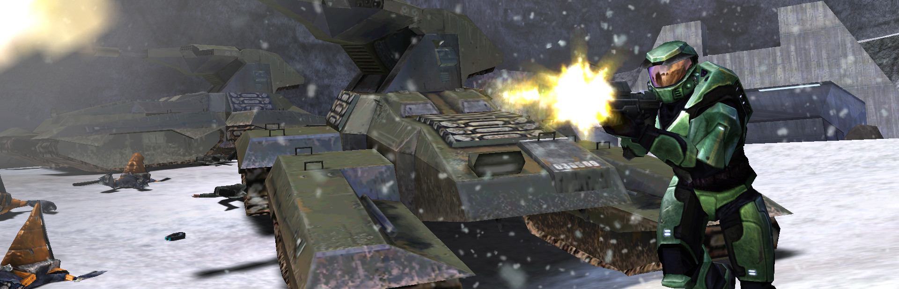
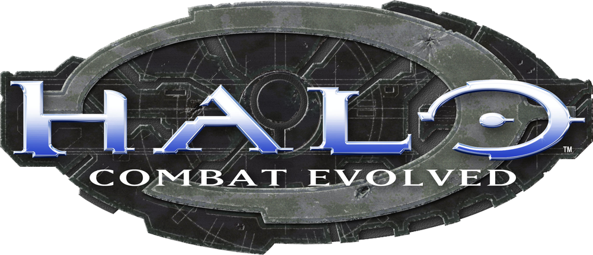

  

  

  <a href="https://github.com/ClassicWasTaken/HaloCE-SteamFrame/releases/download/v1.3.4/Halo-Steam-Frame-Mod-Setup-1.3.4.exe"><strong>DOWNLOAD VR MOD INSTALLER v1.3.4 — WINDOWS EXE</strong></a> 
  One installer file · No administrator rights needed 
  <a href="https://github.com/ClassicWasTaken/HaloCE-SteamFrame/releases/tag/v1.3.4">Release notes &amp; checksum</a>

**Community VR mod installer for Halo: Combat Evolved on Steam Frame.** Installs an experimental native ARM64/OpenXR port with Xbox-style controls and Steam library artwork.

You need **Windows 10/11 x64**, a **Steam Frame**, and your own authorized **original Xbox Halo CE ISO/XISO or extracted maps**. **USA Rev 2 is validated**; Halo PC, Xbox 360 Anniversary, and MCC data are unsupported.

No retail game executable, disc image, maps, product keys, or soundtrack is included or downloaded. Halo artwork and trademarks retain their owners' rights; software components keep their licenses. This community project is unaffiliated with Microsoft, Xbox, Bungie, or Valve.

1. Run the EXE, choose **Install**, and select your ISO or maps folder.
2. Enable Frame Developer Mode, set its user password, and connect over **USB-C** or **Wi-Fi / Ethernet**. The app guides you through SSH setup.
3. Save and close games, keep **Steam Home** running, and click **Install Halo VR**. The first build can take tens of minutes; your Frame needs internet access.

Steam artwork and the description/control guide in **Notes** are added automatically during Install and Repair. Already installed? Choose **Repair** to refresh the game, or **Uninstall** to remove it with an optional save backup.

The port is experimental; newer USB and library features still need physical Frame verification.

[Detailed setup & troubleshooting](docs/SETUP.md) · [Controls](docs/CONTROLS.md) · [Sources](docs/SOURCES.md) · [Third-party notices](docs/THIRD_PARTY.md) · [Build from source](docs/SETUP.md#develop-and-rebuild-the-executable)
