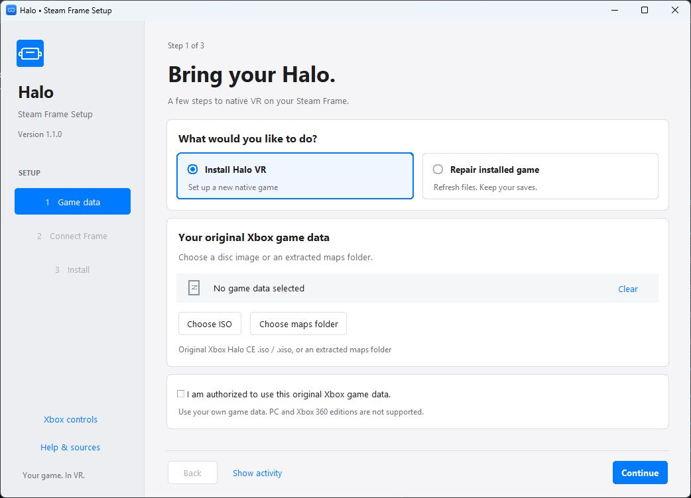

# Halo on Steam Frame — guided native VR setup

A Windows setup app for installing the native ARM64/OpenXR Halo: Combat Evolved port on Steam Frame. Its Apple-inspired interface guides you through choosing game data, connecting over SSH, and installing or repairing the game. Setup copies your own original Xbox data, builds the native VR executable on the Frame, applies Xbox-style controls, and adds a VR shortcut to Steam.

**Version 1.1 — experimental VR support.** The underlying VR implementation is an open upstream pull request. The pinned build and controller changes ran on a real Steam Frame, with the menu and controllers confirmed by its user. This installer has automated component tests; its complete first-install wizard still needs a fresh-device hardware test. Performance varies by scene and device. This is an independent community project, unaffiliated with Microsoft, Bungie, or Valve.

## Download and run

**[Download Halo-Steam-Frame-Setup-1.1.0.exe](https://github.com/ClassicWasTaken/HaloCE-SteamFrame/releases/download/v1.1.0/Halo-Steam-Frame-Setup-1.1.0.exe)**

This is the only installer file you need. It includes all installer dependencies; no ZIP, Python installation, or extra installer file is needed. Run it on Windows 10/11 x64. You do not need administrator rights. The **[version 1.1 release](https://github.com/ClassicWasTaken/HaloCE-SteamFrame/releases/tag/v1.1.0)** description includes its SHA256 checksum.

1. **Game data.** Choose **Install Halo VR**, then use **Choose ISO** or **Choose maps folder** to select an original **Xbox** Halo CE `.iso` / `.xiso`, or its extracted `maps` folder, that you are authorized to use. Setup validates the retail Xbox map format and extracts only the required maps. Halo PC, Xbox 360 Anniversary, MCC, and Quest packages are not inputs for this build. The repository and executable contain no commercial game data or download links for it. Click **Continue** to move to the next step.
2. **Connect Frame.** Follow the app's instructions: enable Developer Mode, set the Frame's user password, keep both devices on the same network, and enter its hostname/IP. The login is `steamos`, normally at `frame`, port 22; username and port are under **Advanced SSH settings**. Click **Test connection** and approve the displayed host fingerprint only after identifying your device. Your password is used in memory and is never saved or logged.
3. **Install.** Save and close games, confirm that setup may briefly restart Steam to add the library entry, then click **Install Halo VR**. Leave the Frame awake and connected. The app uploads maps, creates a rootless build container, compiles the pinned VR source, applies the controls patch, and registers **Halo: Combat Evolved VR (Native)**. It requests a normal Steam shutdown for library registration and restores the Steam session afterward; it does not force-kill the client or a game. The first build may take tens of minutes. Use **Show activity** to view progress details or **Save log** for troubleshooting.



### Already have Halo installed?

Choose **Repair installed game** in the **Game data** step, connect your Frame, and click **Repair Halo VR** in the **Install** step. Setup detects the standard native folder `~/Games/HaloCENativeVR` and reinstalls the native executable, SDL library, controls/tutorial patch, and notices; it restores the required VR/control settings while preserving saves and unrelated settings. Valid original Xbox maps already on the Frame can be reused without selecting another ISO. If maps are missing or damaged, select a valid local image/maps folder and retry. Previous installs made by this installer or the original guided native setup are recognized. A hand-installed native game in the same folder can be adopted only through the explicit Repair action, after its native executable and original Xbox maps validate. Unknown folders and other install locations are not overwritten.

The old PC installation at `~/Games/HaloCEVR` is detected and explained separately. Its PC maps cannot be used for this native Xbox build. Setup installs the native version separately and does not automatically remove the PC version. Close the native game before repair. Program-file backups are retained in the owned build workspace, and a failed repair rolls back the affected files. **Add to Steam again** only repairs library registration; it does not rebuild the game.

The Frame needs ARM64 SteamOS, SteamVR/OpenXR, rootless Podman, internet access, and **12 GiB of free internal storage**. Setup checks these before installing. Your Windows computer needs about 2.5 GB of temporary space for maps. The SteamOS root filesystem stays read-only; dependencies are installed inside a user-owned container.

If Steam cannot close normally, setup reports the remaining step rather than editing a running client's library. Quit Steam and click **Add to Steam again** without rebuilding, or add `~/Games/HaloCENativeVR/halo` as a non-Steam game yourself and use the launch option shown below. Restart Steam after setup if it was already closed.

## Xbox-style controls

| Frame control | Action |
| --- | --- |
| A | Jump / accept |
| B | Melee / back |
| X | Reload / use |
| Y | Change weapon |
| Right trigger / left trigger | Fire / throw grenade |
| Left stick / click | Move / crouch |
| Right stick / click | Turn / zoom |
| Left bumper / right bumper | Change grenade / flashlight |
| Menu / View | Pause / scoreboard |
| Both grips held | Recenter |

Motion aiming stays enabled. Smooth turning defaults to 90 degrees/second, refresh rate to 72 Hz, and render scale to 1.0. Repairs refresh the VR/control defaults and keep unrelated settings and saves. Head movement also satisfies the first-level look tutorial. The patch does not skip the campaign or increase combat difficulty.

The native shortcut uses this **per-game** launch option to prevent the same physical controller from being read through both OpenXR and Steam's virtual gamepad:

```text
SDL_GAMECONTROLLER_ALLOW_STEAM_VIRTUAL_GAMEPAD=0 %command%
```

See [controls and patch details](docs/CONTROLS.md).

## What gets installed

Game: `~/Games/HaloCENativeVR`, including `halo`, bundled SDL3, your maps, config, notices, and an ownership/provenance manifest. New-install saves are in that game's separate `save` folder; repairs preserve existing save locations. Build workspace: `~/.cache/halo-frame-installer`. Source is fetched at the fixed commit below, not a moving branch. Build cache is retained for troubleshooting. Setup does not remove another Halo installation or touch unrelated games.

The renderer uses the Xbox game's data and translated Xbox shaders. Native OpenXR VR and competitive multiplayer come from the port. The PC-only Chimera, PC Restored maps, and HaloCEVR DLLs do not belong in this native build. Multiplayer requires compatible native/OpenCE protocol builds; Halo PC/Custom Edition/MCC servers and PC save files are incompatible.

## Sources and credits

- [OpenCE Steam Frame VR PR #85](https://github.com/OpenCommunityEdition/OpenCE/pull/85), by startupfoundry.
- [Exact VR source commit `88142798513ebd99fc7c6224023e8b44c05d0106`](https://github.com/startupfoundry/halo-ce-universal/tree/88142798513ebd99fc7c6224023e8b44c05d0106), with a documented local controller/tutorial patch.
- [Upstream native Linux/VR build instructions](https://github.com/startupfoundry/halo-ce-universal/blob/88142798513ebd99fc7c6224023e8b44c05d0106/port/linux/README.md#vr).
- [Valve's official Frame setup](https://partner.steamgames.com/doc/steamhardware/steamframe/setup) and [SSH/debugging instructions](https://partner.steamgames.com/doc/steamhardware/steamframe/debugging).

Full source attribution, decompilation lineage, multiplayer references, and third-party licenses are in [SOURCES.md](docs/SOURCES.md) and [THIRD_PARTY.md](docs/THIRD_PARTY.md). Original installer code is MIT licensed. Upstream notices apply separately; no license here grants rights to commercial game data.

## Troubleshooting

- **Cannot resolve `frame`:** use the Frame's IP address from its network settings. Both devices must be on a network that permits connections between clients.
- **Connection refused:** enable Developer Mode and verify the address and SSH port. [Valve guide](https://partner.steamgames.com/doc/steamhardware/steamframe/debugging).
- **Authentication fails:** enter the password set in the Frame's Developer settings; your Steam account password is unrelated.
- **Host key changed:** setup refuses the connection. Verify the new device/key independently before removing its old public fingerprint from `%LOCALAPPDATA%/HaloFrameInstaller/hosts.json`.
- **Insufficient disk space or Podman missing:** resolve the failed preflight check and retry. Setup does not disable SteamOS protections or install system packages as root.
- **Build/download fails:** save the setup log, keep the Frame's build log, and retry. A failed staging build does not replace an existing game or save.
- **Flat window instead of VR:** wake the headset and start SteamVR before launching. The port falls back to a flat window if no usable OpenXR session is available.
- **Controls doubled:** check the native shortcut's launch option above. Steam Input may otherwise add a second virtual controller stream.
- **Library entry absent:** fully quit Steam and retry registration, or use Add a Non-Steam Game with the executable and launch option above. Enable “Include in VR Library” in its Steam properties.

The release executable is unsigned. Verify its SHA256 against the checksum in the release description; this project does not ask you to disable antivirus or other security protections. Review logs for private information before posting an issue.

## Develop and rebuild the executable

```powershell
python -m venv .venv
.\.venv\Scripts\python -m pip install -e ".[dev]"
.\.venv\Scripts\python -m pytest
.\.venv\Scripts\python -m halo_frame_installer
.\.venv\Scripts\python scripts/build_release.py
```

Corresponding installer source and applicable third-party source/notices are available in the **[version 1.1.0 source tag](https://github.com/ClassicWasTaken/HaloCE-SteamFrame/tree/v1.1.0)** so you can modify and rebuild it, including its LGPL Paramiko dependency. GitHub's automatically generated Source code ZIP is optional for developers and is not needed to run setup. The build script packages only installer code/resources; no game binary, user ISO, maps, SSH password, or private key is included. GitHub Actions runs tests and builds the Windows setup executable. A local rebuild also writes a source bundle and checksum file to `dist/`; the public release attaches only the clearly named installer executable and prints its checksum in the release description.

Before reporting a hardware test, record the SteamOS/SteamVR version, source commit, install status, and whether menu, campaign, Xbox controls, tutorial, and compatible multiplayer worked. Do not attach game data or credentials.
