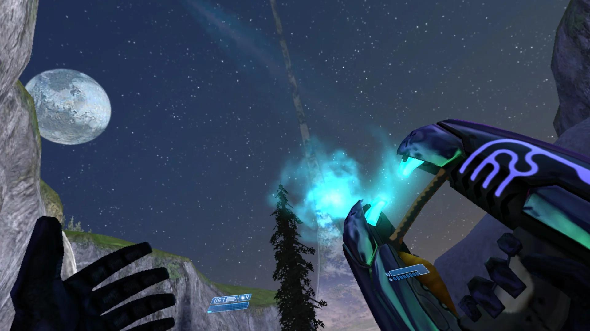

  

  

<h1 align="center">Halo CE Steam Frame VR Mod</h1>

<h2 align="center">
  <a href="https://github.com/ClassicWasTaken/HaloSteamFrameMod/releases/download/v1.4.2/Halo-Steam-Frame-Mod-Setup-1.4.2.exe">Download 1.4.2 — Windows installer (.exe)</a>
</h2>

  <strong>Halo-Steam-Frame-Mod-Setup-1.4.2.exe</strong> 
  Windows 10/11 x64 · One file · Runtime and USB tools included 
  <a href="https://github.com/ClassicWasTaken/HaloSteamFrameMod/releases/tag/v1.4.2">Release notes &amp; SHA256 checksum</a> · <a href="docs/BUILD_PROVENANCE.md">Verify release provenance</a>

Play native ARM64/OpenXR Halo CE on Steam Frame with **LAN and online campaign co-op**, **head-directed walking**, and **Xbox-style buttons**. Tracked controller aiming, a render-rate reticle, half-strength stereo sun glow, and automatic Steam artwork and Notes are included.

**1.4.2 adds SD-card installation and menus that open in front of your current headset view.** It retains the tutorial and unarmed-flashlight fixes, standing mode and snap turning, with improved cancellation, upgrade recovery and USB tool selection.

## Install or upgrade

You need a Steam Frame with internet access and **12 GiB free on the selected storage**, plus your own authorized **original Xbox Halo CE ISO/XISO or extracted maps**. USA Rev 2 was validated with the stable installer. SD cards need a mounted, writable, executable **ext4 or f2fs** filesystem. PC, Anniversary and MCC data are unsupported.

1. **Run the EXE and choose Install or Repair.** Select your Xbox game data for a first install. Choose Repair to update an existing native installation using its verified maps without another ISO.
2. **Connect your Frame over USB-C or network SSH.** Enable Developer Mode, set the Frame's user password, and follow the installer's connection guide.
3. **Choose Internal storage or SD card.** Click **Refresh storage**, select the detected card and check the destination. Install, Repair and Uninstall use this selection.
4. **Save and close games, then start installation.** Keep Steam Home and SteamVR running, and leave the Frame awake and connected. Building on the Frame can take tens of minutes.

Internal installs keep **Halo: Combat Evolved VR (Native)**. SD installs use **Halo: Combat Evolved VR (Native, SD card)** and keep your internal copy. A new SD install has separate profiles and saves; existing 1.4.x saves on the selected location stay in `save-v1.4`. Upgrading from 1.3.5 retains old saves but requires a **new profile and campaign**.

[Setup & co-op](docs/SETUP.md) · [SD-card guide](docs/SD_CARD.md) · [Controls](docs/CONTROLS.md) · [Release notes](docs/RELEASE_NOTES.md) · [Sources](docs/SOURCES.md) · [Third-party notices](docs/THIRD_PARTY.md)

*Community VR example by [u/Sea-Communication760](https://www.reddit.com/r/virtualreality/comments/1wpvi8n/halo_halocevr_working_great_on_steam_frame/): PC HaloCEVR on Steam Frame through Proton ARM. This is not a native 1.4.2 capture.*

No retail executable, disc image, maps, keys or soundtrack is included or downloaded. Halo artwork and third-party components retain their rights and notices.
