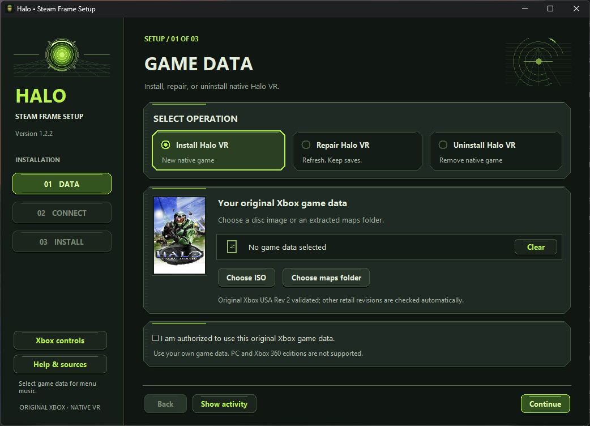
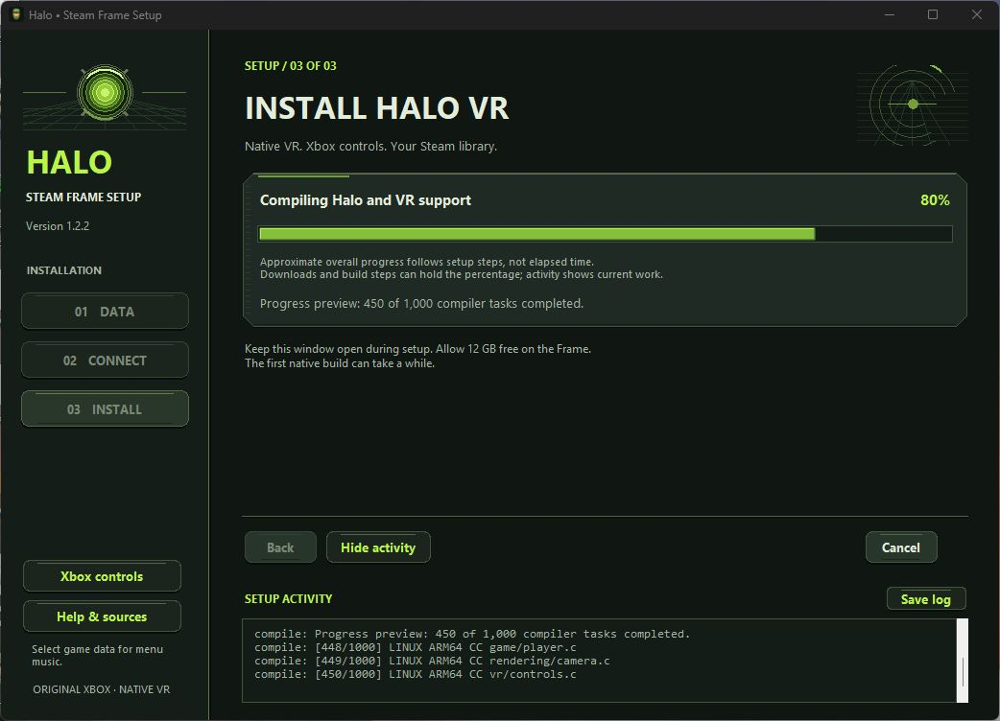

# Halo on Steam Frame — guided native VR setup

A Windows setup app for installing the native ARM64/OpenXR Halo: Combat Evolved port on Steam Frame. Its original Xbox dashboard-inspired interface uses dark panels, luminous green accents, and beveled controls to guide you through choosing game data, connecting over SSH, and installing or repairing the game. Setup copies your own original Xbox data, builds the native VR executable on the Frame, applies Xbox-style controls, and guides Steam library registration with Halo CE cover art.

**Version 1.2.3 — experimental VR support.** Setup keeps Steam Home and SteamVR running; it no longer sends a Steam shutdown or starts another Steam client. Direct library-file edits require Steam to be already closed, with manual steps shown when needed. The underlying VR implementation is an open upstream pull request. The pinned build and controller changes ran on a real Steam Frame, with the menu and controllers confirmed by its user. The 1.2.3 live helper also removed and re-added the native Steam shortcut, verified its settings, and added both library images with matching hashes on a Frame while Steam and VR stayed active and unchanged; the game binary was unchanged. This installer has automated component tests; its complete first-install wizard and full game uninstall still need fresh-device hardware tests. Performance varies by scene and device. This is an independent community project, unaffiliated with Microsoft, Bungie, or Valve.

## Download and run

**[Download Halo-Steam-Frame-Setup-1.2.3.exe](https://github.com/ClassicWasTaken/HaloCE-SteamFrame/releases/download/v1.2.3/Halo-Steam-Frame-Setup-1.2.3.exe)**

This is the only installer file you need. It includes all installer dependencies; no ZIP, Python installation, or extra installer file is needed. Run it on Windows 10/11 x64. You do not need administrator rights. The **[version 1.2.3 release](https://github.com/ClassicWasTaken/HaloCE-SteamFrame/releases/tag/v1.2.3)** description includes its SHA256 checksum.

The executable has a Master Chief helmet icon with olive armor and a gold visor, drawn for this project.

1. **Game data.** Choose **Install Halo VR**, then use **Choose ISO** or **Choose maps folder** to select an original **Xbox** Halo CE `.iso` / `.xiso`, or its extracted `maps` folder, that you are authorized to use. Setup validates the retail Xbox map format and extracts only the required maps. Halo PC, Xbox 360 Anniversary, MCC, and Quest packages are not inputs for this build. The repository and executable contain no commercial game data or download links for it. Click **Continue** to move to the next step.
2. **Connect Frame.** Follow the app's instructions: enable Developer Mode, set the Frame's user password, keep both devices on the same network, and enter its hostname/IP. The login is `steamos`, normally at `frame`, port 22; username and port are under **Advanced SSH settings**. Click **Test connection** and approve the displayed host fingerprint only after identifying your device. Your password is used in memory and is never saved or logged.
3. **Install Halo VR.** Save and close games, confirm **I have saved and closed games on my Frame**, then click **Install Halo VR**. Keep Steam Home and SteamVR running, and leave the Frame awake and connected. The app uploads maps, creates a rootless build container, compiles the pinned VR source, applies the controls patch, and registers **Halo: Combat Evolved VR (Native)** through the running Steam client when its verified library interface is available. Any remaining shortcut or artwork step is shown at the end; it does not require rebuilding the game. The first build may take tens of minutes. Activity opens automatically and shows the current phase and live build output; use **Save log** for troubleshooting.

The installation bar fills from left to right and does not move backward during a run. Its overall percentage combines weighted stages with measured upload bytes and completed Ninja build tasks. During work without a measurable total, such as package setup or configuration, the bar holds its last value while the activity feed continues showing available output. This percentage describes completed work, not elapsed time or a finish-time estimate. Failure or cancellation preserves the reached progress; a remaining manual Steam or artwork step stays at 99%, and only full success reaches 100%.

Setup explicitly closes its SFTP and command channels and the underlying SSH connection before reporting completion. The activity feed shows disconnecting and disconnected stages; failure and cancellation also close that connection. Closing setup's SSH session does not change the Frame's Wi-Fi or Steam streaming settings.

These changes apply after you launch the new EXE and start a run. An installation already running in an older EXE keeps its existing behavior; downloading a replacement cannot change that ongoing process.



Progress preview with sample compiler output:



After you select valid local Xbox game data, the installer automatically loops the original Halo menu music. Setup reads the menu loop from your own `ui.map`, decodes it at 12% of the original sample amplitude, and keeps the temporary audio on your Windows computer until the installer closes. No soundtrack is bundled, downloaded, or uploaded to the Frame. Repair using only maps already on the Frame has no local music preview. If music is unavailable, installation can continue.

### Supported Xbox ISO revisions

Use **Halo: Combat Evolved for the original Xbox**. **USA Rev 2 is validated with this installer.** Other retail revisions, including an original USA release or an image labeled **USA Rev 1**, and PAL releases are accepted when their actual map headers match one of these supported builds:

| Map-header build | Upstream region |
| --- | --- |
| `01.10.12.2276` | NTSC |
| `01.08.15.1749` | NTSC |
| `01.01.14.2342` | PAL |

These builds come from the [pinned port's compatibility table](https://github.com/startupfoundry/halo-ce-universal/blob/88142798513ebd99fc7c6224023e8b44c05d0106/source/cache/cache_files.c#L616-L631). Its [PAL conversion notes](https://github.com/startupfoundry/halo-ce-universal/blob/88142798513ebd99fc7c6224023e8b44c05d0106/port/linux/game/pal_tags.c#L4-L22) describe the shared NTSC maps across three retail releases. Setup checks the image contents, not its filename or a Rev label: it requires all 24 original Xbox version-5 maps from one supported build. Incomplete or mixed-build sets and unlisted builds are rejected. Halo PC/Custom Edition, Xbox 360 Anniversary, MCC, and Quest packages are unsupported inputs. Supply your own authorized retail ISO/XISO or extracted maps.

### Already have Halo installed?

Choose **Repair Halo VR** in the **Game data** step, connect your Frame, and click **Repair Halo VR** in the **Install Halo VR** step. Setup detects the standard native folder `~/Games/HaloCENativeVR` and reinstalls the native executable, SDL library, controls/tutorial patch, and notices; it restores the required VR/control settings while preserving saves and unrelated settings. Valid original Xbox maps already on the Frame can be reused without selecting another ISO. If maps are missing or damaged, select a valid local image/maps folder and retry. Previous installs made by this installer or the original guided native setup are recognized. A hand-installed native game in the same folder can be adopted only through the explicit Repair action, after its native executable and original Xbox maps validate. Unknown folders and other install locations are not overwritten.

The old PC installation at `~/Games/HaloCEVR` is detected and explained separately. Its PC maps cannot be used for this native Xbox build. Setup installs the native version separately and does not automatically remove the PC version. Close the native game before repair. Program-file backups are retained in the owned build workspace, and a failed repair rolls back the affected files. **Add to Steam again** repairs library registration and adds missing library artwork; it does not rebuild the game.

The Frame needs ARM64 SteamOS, SteamVR/OpenXR, rootless Podman, internet access, and **12 GiB of free internal storage**. Setup checks these before installing. Your Windows computer needs about 2.5 GB of temporary space for maps. The SteamOS root filesystem stays read-only. Podman runs as the ordinary `steamos` host user; dependency installation uses root only inside the rootless container, with `no-new-privileges` retained.

With Steam running, setup uses the current client's library interface and verifies the native executable, launch options, VR flag, and disabled compatibility tool before reporting registration success. This interface is undocumented and may change with Steam updates. If it is unavailable, ambiguous, or cannot verify the result within its time limit, setup keeps the headset session running and shows manual steps. Use Steam's **Add a Game > Add a Non-Steam Game** to select `~/Games/HaloCENativeVR/halo`, apply the launch option below, and enable **Include in VR Library**. Leave forced compatibility tools disabled for this native Linux executable. **Add to Steam again** retries available library setup without rebuilding. If Steam is already closed, setup can use backed-up atomic library-file updates; it never shuts down, launches, or restarts the headset's Steam session.

### Uninstall Halo VR

Choose **Uninstall Halo VR** on the first page to remove the recognized, owned native installation at `~/Games/HaloCENativeVR` and its native Steam shortcut. You do not need an ISO or local maps for uninstall, but you must connect over SSH with the Frame's user password. Save and close games; keep Steam Home and SteamVR running. Setup asks the running client to remove the exact native shortcut from its active account, then verifies that removal before deleting game files. If the client interface is unavailable or removal cannot be verified, setup keeps the native game files and stops at 99%, explaining Steam's **Remove Non-Steam Game** option. An owned installation build still running also stops removal before deletion. Setup never shuts down or relaunches Steam. If Steam is already closed, automatic removal can use its backed-up library-file path across the local accounts.

**Keep my campaign saves in a backup (recommended)** is checked by default. Setup backs up saves inside the native game folder and the original config to `~/Games/HaloCENativeVR-saves-<operation ID>`, and reports the exact backup location. The recognized native folder, including its maps, program files, and config, is then removed; configured saves outside that folder remain untouched. Turning off the checkbox allows saves inside the removed folder to be deleted. Uninstall leaves unrelated games, foreign or unrecognized folders, and unrelated settings alone. The build cache remains available for troubleshooting. Setup disconnects its SSH session after the operation and reaches 100% only after completion.

With the client running, Steam controls artwork cleanup for the removed entry; setup does not delete its live grid files. With Steam already closed, setup removes only artwork matching the installer's known image hashes and preserves custom images.

## Xbox-style controls

| Frame control | Action |
| --- | --- |
| A | Jump / accept |
| B | Melee / back |
| X | Reload / use |
| Y | Change weapon |
| Right trigger / left trigger | Fire / throw grenade |
| Left stick / click | Move / crouch |
| Right stick / click | Turn / zoom |
| Left bumper / right bumper | Change grenade / flashlight |
| Menu / View | Pause / scoreboard |
| Both grips held | Recenter |

Motion aiming stays enabled. Smooth turning defaults to 90 degrees/second, refresh rate to 72 Hz, and render scale to 1.0. Repairs refresh the VR/control defaults and keep unrelated settings and saves. Head movement also satisfies the first-level look tutorial. The patch does not skip the campaign or increase combat difficulty.

The native shortcut uses this **per-game** launch option to prevent the same physical controller from being read through both OpenXR and Steam's virtual gamepad:

```text
SDL_GAMECONTROLLER_ALLOW_STEAM_VIRTUAL_GAMEPAD=0 %command%
```

See [controls and patch details](docs/CONTROLS.md).

## What gets installed

Game: `~/Games/HaloCENativeVR`, including `halo`, bundled SDL3, your maps, config, notices, and an ownership/provenance manifest. New-install saves are in that game's separate `save` folder; repairs preserve existing save locations. Build workspace: `~/.cache/halo-frame-installer`. Source is fetched at the fixed commit below, not a moving branch. Build cache is retained for troubleshooting. Setup does not remove another Halo installation or touch unrelated games.

The original Halo CE cover is shown inside the installer. With Steam running, setup asks the verified client interface to add missing portrait and landscape art for the native shortcut, verifies the active account and executable, and checks the written image hashes. It does not directly write live Steam grid files. If Steam is already closed, setup can use guarded file updates instead. Both paths preserve existing artwork, including custom images with another supported file extension. The landscape layout keeps the cover's proportions. Repair and **Add to Steam again** use the same artwork handling. If artwork cannot be verified, setup reports a manual artwork step separately from shortcut registration. Artwork is bundled with the installer; no separate download is needed. The new Steam artwork still needs an on-device visual check.

The renderer uses the Xbox game's data and translated Xbox shaders. Native OpenXR VR and competitive multiplayer come from the port. The PC-only Chimera, PC Restored maps, and HaloCEVR DLLs do not belong in this native build. Multiplayer requires compatible native/OpenCE protocol builds; Halo PC/Custom Edition/MCC servers and PC save files are incompatible.

## Sources and credits

- [OpenCE Steam Frame VR PR #85](https://github.com/OpenCommunityEdition/OpenCE/pull/85), by startupfoundry.
- [Exact VR source commit `88142798513ebd99fc7c6224023e8b44c05d0106`](https://github.com/startupfoundry/halo-ce-universal/tree/88142798513ebd99fc7c6224023e8b44c05d0106), with a documented local controller/tutorial patch.
- [Upstream native Linux/VR build instructions](https://github.com/startupfoundry/halo-ce-universal/blob/88142798513ebd99fc7c6224023e8b44c05d0106/port/linux/README.md#vr).
- [Valve's official Frame setup](https://partner.steamgames.com/doc/steamhardware/steamframe/setup) and [SSH/debugging instructions](https://partner.steamgames.com/doc/steamhardware/steamframe/debugging).
- [Original Xbox dashboard visual references](docs/SOURCES.md#dashboard-visual-references) and [Halo CE cover-art attribution](docs/SOURCES.md#steam-library-artwork).

Full source attribution, decompilation lineage, multiplayer references, and third-party licenses are in [SOURCES.md](docs/SOURCES.md) and [THIRD_PARTY.md](docs/THIRD_PARTY.md). Original installer code is MIT licensed. Upstream notices apply separately; no license here grants rights to commercial game data.

## Troubleshooting

- **Cannot resolve `frame`:** use the Frame's IP address from its network settings. Both devices must be on a network that permits connections between clients.
- **Connection refused:** enable Developer Mode and verify the address and SSH port. [Valve guide](https://partner.steamgames.com/doc/steamhardware/steamframe/debugging).
- **Authentication fails:** enter the password set in the Frame's Developer settings; your Steam account password is unrelated.
- **Host key changed:** setup refuses the connection. Verify the new device/key independently before removing its old public fingerprint from `%LOCALAPPDATA%/HaloFrameInstaller/hosts.json`.
- **Insufficient disk space or Podman missing:** resolve the failed preflight check and retry. Setup does not disable SteamOS protections or install system packages as root.
- **Build/download fails:** the error dialog shows a short failure headline; open **Show activity** or **Save log** for the full redacted details. Keep the Frame's build log and retry. Version 1.2.1 fixes the container dependency-installation permission errors (`setgroups`, `seteuid`, or APT cache permissions) seen in 1.2.0. Retry can reuse previously uploaded maps only when the complete map set matches the selected local data manifest and passes header and SHA256 verification; otherwise setup uploads fresh data. Reused data stays in its previous owned upload run and is verified again at build and finalization. A failed staging build does not replace an existing game or save.
- **Unsupported ISO or maps:** choose original Xbox retail data matching a [supported map build](#supported-xbox-iso-revisions). USA Rev 2 is validated; a filename containing Rev 1 or Rev 2 does not establish compatibility by itself. Keep all required maps from one release together.
- **Flat window instead of VR:** wake the headset and start SteamVR before launching. The port falls back to a flat window if no usable OpenXR session is available.
- **Controls doubled:** check the native shortcut's launch option above. Steam Input may otherwise add a second virtual controller stream.
- **Library entry absent:** click **Add to Steam again** to retry registration through the running client. If its library interface remains unavailable, use Steam's **Add a Non-Steam Game** with the executable and launch option above. Enable **Include in VR Library** and leave forced compatibility tools disabled in its properties. Setup's direct library-file edits require Steam to be already closed.
- **Box art absent:** click **Add to Steam again** to retry artwork through the running client, or use Steam's custom artwork controls if its interface remains unavailable. Setup's direct file edits require Steam to be already closed. Existing custom artwork is kept. An artwork error is reported separately from successfully adding the game shortcut.
- **Steam Home remains on a loading logo after an older installer run:** 1.2.3 removes the automatic shutdown request that disrupted the SteamOS-managed session in a reported case. It does not repair a session already in a failed state. Restart the Frame using its normal power controls, and contact Steam Support if Steam Home does not return. [Steam session safeguard and diagnostic sources](docs/SOURCES.md#steam-session-safeguard).
- **Menu music unavailable:** select valid local original Xbox data containing `ui.map`; music starts automatically after validation. A repair using only remote maps cannot preview music. Playback errors do not block setup; Windows volume controls the final sound level.

The release executable is unsigned. Verify its SHA256 against the checksum in the release description; this project does not ask you to disable antivirus or other security protections. Review logs for private information before posting an issue.

## Develop and rebuild the executable

```powershell
python -m venv .venv
.\.venv\Scripts\python -m pip install -e ".[dev]"
.\.venv\Scripts\python -m pytest
.\.venv\Scripts\python -m halo_frame_installer
.\.venv\Scripts\python scripts/build_release.py
```

Corresponding installer source and applicable third-party source/notices are available in the **[version 1.2.3 source tag](https://github.com/ClassicWasTaken/HaloCE-SteamFrame/tree/v1.2.3)** so you can modify and rebuild it, including its LGPL Paramiko dependency. GitHub's automatically generated Source code ZIP is optional for developers and is not needed to run setup. The build script packages only installer code/resources; no game binary, user ISO, maps, SSH password, or private key is included. GitHub Actions runs tests and builds the Windows setup executable. A local rebuild also writes a source bundle and checksum file to `dist/`; the public release attaches only the clearly named installer executable and prints its checksum in the release description.

The workflow also includes an ARM64 Linux check, [check-build-container.py](scripts/check-build-container.py), that uses the same rootless Podman arguments as the Frame build. It checks APT package installation, `setgroups`, `seteuid`, `setegid`, `chown`, and that container output belongs to the ordinary host user. The Windows executable CI job depends on that check as well as the unit tests. This container check uses no game data and does not replace a full Steam Frame installation test.

Before reporting a hardware test, record the SteamOS/SteamVR version, source commit, install status, and whether menu, campaign, Xbox controls, tutorial, and compatible multiplayer worked. Do not attach game data or credentials.
